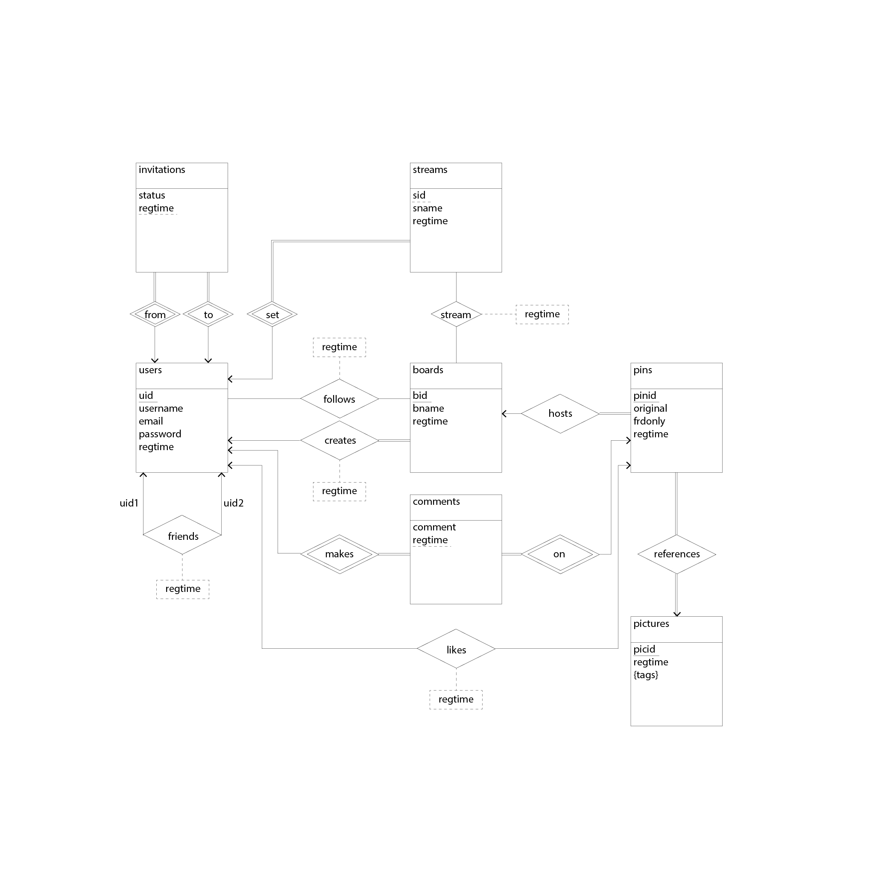
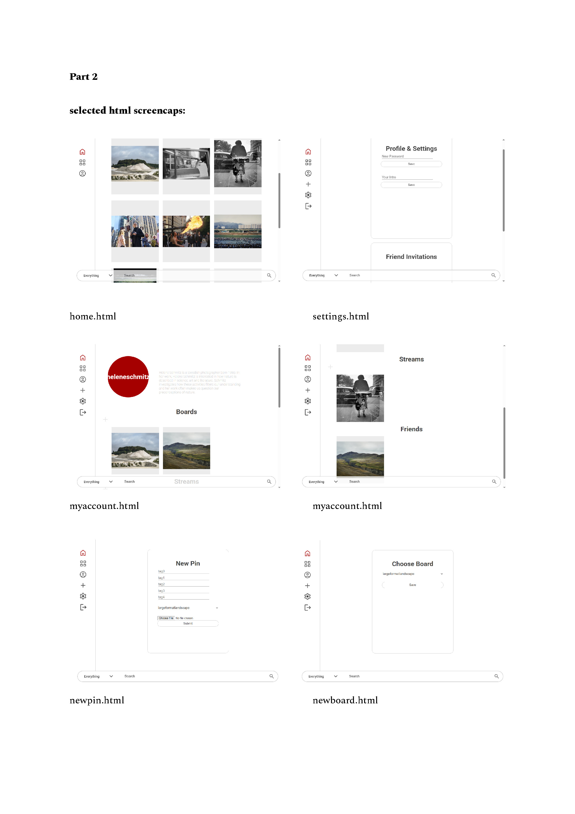

# Pinterest-like Full-stack Application

## 0. Introduction & Outline

This repository hosts the source code of a full-stack app that emulates the functionalities of Pinterest. Supported features include:

* Homepage displaying all pins available on site
* Creation/Deletion of new pin, board, and streams of selected boards with tags
* Search for pins by tag
* Registration of new accounts with email, password, name etc.
* Personal boards with pinned imaged
* Personal stream feed with images from boards of other users
* Adding friends whose posts you can see in a stream
* Commenting on and liking pins

The writeup describes project details in the following order:

1. App architecture
1. Frontend design
1. Backend design
4. Build & Run

*I do not own any of the images used as sample entries in the app. These are works of professional photographers including, in alphabetical order, Andreas Gursky, Fan Ho, Joel Meyerowitz, and Helene Schmidt.

 <!-- IMAGE HERE -->

## 1. App architecture

The app was written in Python, built upon the Django framework, and used PostgreSQL as the backend database service provider. The diagram below lays out the main components.

```
.
├── manage.py
├── pclone/                 # configuration package with global settings
│   ├── settings.py
│   ├── urls.py
├── pinterest/              # application package with actual functionalities
│   ├── models.py 
│   ├── migrations/
│   ├── urls.py
│   ├── forms.py
│   ├── utils.py
│   ├── views.py
│   ├── templates/
│   └── static/
├── icons/                  # directory storing icons used
└── media/                  # directory storing uploaded images
```


| dir  | filename | purpose |
| ----- | ------|--------|
| `pclone`| `settings.py`| defines database connection, applications to include, static and media folder connections |
| ''| `urls.py`| defines which url connects to which application's views.py file |
| `pinterest` | `models.py`| defines the relational database structure, with changes incrementally saved in `migrations/` |
| '' | `urls.py`| defines the view functions each url should call |
| '' | `forms.py`| defines forms to retrieve data from db |
| '' | `utils.py`| defines functions to be called within the app |
| '' | `views.py`| defines how each page should behave, including rendering of html files saved in `templates/`, redirection, and data retrieval from database |
| '' | `static/` | hosts `.css` and `.js` files that define content display style |

## 2. Backend design

#### 2.1 Database schema & ER Diagram

Database schema design provides for the following use cases:

- "Friends" is modelled as a relationship because any 2 individuals can only be friends or not be friends, so there is only 1 instance of combination between them;
- "Invitations" is modelled as an entity with registration time included as part of the primary key to allow for multiple invitations to be sent between 2 individuals. This implies that users can reconnect as friends after 'unfriending' each other;
- "Streams" is modelled as a weak entity as every stream must have an owner, every user can create multiple streams, and not a relationship so that multiple streams created by the same user can follow the exact same boards, and any one board can be saved to multiple streams created by the same user. It can also contain no boards;
- "Pins" is modelled as a weak entity and not relationship so that each pin can be related to multiple comments, a single picture, and multiple boards, in eff ect turing a non-binary relationship into binary, but each picture can only be pinned to the same board of the same user once;
- "Comments" is modelled as a weak entity as it depends on the user and pin, and not as a relationship so that users can comment on the same pin multiple times at diff erent times;
- The brief requires that "likes" be attributed to the original photo, and comments be attributed to the pin. However, it does not make sense that likes are attributed to the original photo. The interaction is between 2 people, and should be tied to the person who created the pin and the person who gave the like, and not the person who uploaded the original image. In this model, "pins" are tied to the creator of the pin, not the original picture, and "comments" are tied to pins.
<br><br>


#### Sample Data Table for the 'invitations' relation

| uid1  | uid2  | status | regtime                   |
| ----- | ------|--------|---------------------------|
| `0001`| `0003`| 1      | 2025-04-26 16:02:62.786001|
| `0002`| `0004`| 1      | 2025-04-26 20:47:28.420844|
| `0001`| `0002`| 2      | 2025-04-27 15:22:58.647293|

Status 1 indicates a friend request initiated but not accepted yet. <br>
Status 2 indicates acceptance.<br>
Status 3 indicates rejection or friend removal.

---

#### 2.2 App setup

#### 2.2.1 App url definitions

There are 2 ```urls.py```. The one in ```pclone/``` is the master file that sets up all urls. The one in ```pinterest/``` defines urls used for this application only.

#### 2.2.2 Connecting database to app

The following lines in ```settings.py``` connect PostgreSQL database to the app:

> ```
> DATABASES = {
>	'default': {
>		'ENGINE': 'django.db.backends.postgresql',		
>		'NAME': 'pindb',					            
>		'USER': 'postgres',					            
>		'PASSWORD': 'xxxx',					            
>		'HOST': 'localhost',
>		'PORT': '5432'
>	}
> }
> ```

Each time the database is modified, changes made are saved in ```pinterest/migrations/```. 

#### 2.2.3 Define page functions

```pinterest/views.py``` is the file that defines how each page behaves. Explanation for 1 function can be generalized to all:

```
@login_required(login_url = 'login_user')
def likepin(request, pinid):	
	username = request.user.username

	with connection.cursor() as cursor:
		cursor.execute("""
			SELECT uid FROM users WHERE username = %s
 		""", [username])
 		uid = cursor.fetchone()
 		cursor.execute("""
 			SELECT 1 FROM likes WHERE uid = %s AND pinid = %s
 		""", [uid[0], pinid])
 		existlike = cursor.fetchone() is not None

 		if not existlike: # save to likes
 			cursor.execute("""
 				INSERT INTO likes (uid, pinid) VALUES (%s, %s)
 			""", [uid[0], pinid])
 		else: #remove from likes
 			cursor.execute("""
 				DELETE FROM likes WHERE uid = %s AND pinid = %s
 			""", [uid[0], pinid])

 	return redirect(request.META.get('HTTP_REFERER', reverse('allpins')))
```

Function breakdown:

```
@login_required(login_url = 'login_user')
```

A Django decorator that restricts access to logged‑in users only. If an unauthenticated user tries to visit this view, Django automatically redirects them to the URL named 'login_user'.

```
def likepin(request, pinid):
```
Function signature that defines the view.

```request``` – the HTTP request object containing metadata (user, headers, etc.).

```pinid``` – an integer captured from the URL that identifies which pin is being liked/unliked.

```
username = request.user.username
```
Extracts the username of the currently logged‑in user from the request object and stores it in a variable.

```
with connection.cursor() as cursor:
```
Opens a raw database connection cursor. 

The ```with``` statement ensures the cursor is properly closed after the block finishes, even if an error occurs.

```connection``` refers to Django’s default database connection (imported via from django.db import connection).

```
cursor.execute("""
        SELECT uid FROM users WHERE username = %s
    """, [username])
```
Executes a raw SQL query to fetch the primary key (uid) of the user from a custom users table. Uses parameterised queries (%s placeholders with a list of values) to prevent SQL injection attacks.

```
uid = cursor.fetchone()
```
Fetches the first row of the query result. ```uid``` will be a tuple like ```(42,)``` if the user exists, or ```None``` if not found.

```
cursor.execute("""
    SELECT 1 FROM likes WHERE uid = %s AND pinid = %s
""", [uid[0], pinid])
```
Checks if a like already exists for this specific user and this specific pin.

```
existlike = cursor.fetchone() is not None
if not existlike: # save to likes
    cursor.execute("""
        INSERT INTO likes (uid, pinid) VALUES (%s, %s)
    """, [uid[0], pinid])
else: #remove from likes
    cursor.execute("""
        DELETE FROM likes WHERE uid = %s AND pinid = %s
    """, [uid[0], pinid])
```
If existlike is False (no like yet), execute an INSERT statement and create a new record in the likes table.

If existlike is True, executes a DELETE statement and remove the existing like record from the likes table.

```
return redirect(request.META.get('HTTP_REFERER', reverse('allpins')))
```
Send the user back to the page they came from

---

#### 2.3 Design tradeoffs

Sample code above illustrates how the application layer interact with the database to achieve the designated goal of each page function. This means that trade-offs exist between the application and database layer in deciding which layer handles which part of the solution.

One of the most significant decisions in the design is the method with which to store the uploaded images. The most straightforward method is to store image as object of type ```BYTEA``` (Binary Data) directly inside the database.

The benefit is easy retrieval. However, it suffers from high database and Python overhead. By storing large object inside the database, scaling the app becomes intrinsically tied to scaling database storage, which can be expensive considering commercial database service cost (E.G. Provisioned IOPS (Input/Output Operations Per Second) for cloud databases): 

- storage cost per GB (disk types)
- I/O cost and performance tiers (provisioned IOPS, etc.)
- Memory/RAM cost
- Backup and replication costs
- Licensing and compute overhead...

In short, large objects incurs more I/O operations. By storing only the directory, then fetch the associated image at the application layer, extra cost is avoided.


---

## 3. Frontend design

The application roughly emulates the behavior of Pinterest. The application UI is designed so that functionalities are grouped and made accessible at nested layers to maintain a simple and clean sidebar. The sidebar and search bar are fixed on screen to be accessible across all pages, with specific icons for the homepage, personal pins page, account information page, page for new pins, settings, and logging out. All other functions such as liking pins, adding friends, responding to friend requests, are to be accessed through these pages.




## 4. Build & Run

####  4.1 Build environment

Running this app seamlessly following commands in the next section requires ``Anaconda/Miniconda``. Otherwise, packages/frameworks needed are outlined in "dependencies" section in ``environment.yml``.

```anaconda powershell prompt
conda env create -f environment.yml
conda list
conda activate pinenv
```

This creates a new Conda virtual environment with pip installed. Then you can proceed to activating the virtual environment, and installing the rest of the packages with pip. 

####  4.2 Run Server

```powershell
cd mysite
python manage.py runserver
```

Enter directory that hosts the root of the Django framework, then run 'runserver' to get link for html preview.